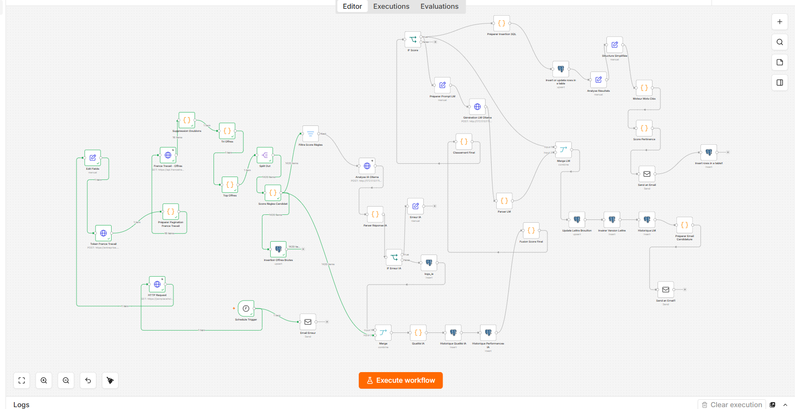

# Job Automation Assistant V2

## Présentation

Job Automation Assistant V2 est une plateforme d'automatisation de recherche d'emploi développée avec n8n, PostgreSQL, Docker et Ollama.

Le projet récupère automatiquement des offres depuis l'API France Travail, applique des règles de sélection personnalisées, réalise une analyse IA locale, génère des lettres de motivation et stocke l'ensemble des données dans PostgreSQL afin de constituer un historique exploitable pour la Data Analyse.

---

# Fonctionnalités

## Collecte automatisée

* API France Travail
* Pagination multi-pages
* Pagination multi-jours
* Recherche par mots-clés
* Suppression automatique des doublons

## Base de données

* PostgreSQL 16
* Historisation des offres
* Historisation des lettres
* Journalisation IA
* Mesure qualité IA
* Mesure performances IA

## Intelligence Artificielle

### Analyse des offres

Modèle :

```text
gemma3:1b
```

Fonctions :

* résumé automatique
* score IA
* détection des compétences
* recommandations

### Génération de lettres

Modèle :

```text
phi4
```

Fonctions :

* génération automatique
* personnalisation
* historisation

## Data Analyse

* stockage des offres brutes
* export CSV
* préparation de datasets
* exploitation SQL

---

# Architecture

```text
France Travail API
        ↓
Pagination Multi-Jours
        ↓
Pagination Multi-Pages
        ↓
Suppression Doublons
        ↓
Tri Offres
        ↓
                 +-----------------------------+
                 |                             |
                 v                             v
         Offres Brutes PostgreSQL       Score Règles
                                               ↓
                                       Analyse IA Ollama
                                               ↓
                                       Parser Réponse IA
                                               ↓
                                         Logs IA
                                               ↓
                                         Qualité IA
                                               ↓
                                      Performances IA
                                               ↓
                                      Fusion Score Final
                                               ↓
                                     Génération LM Ollama
                                               ↓
                                      Historique LM
                                               ↓
                                           Email
```

---

# Workflow n8n V2



---

# Technologies

## Automatisation

* n8n

## Base de données

* PostgreSQL 16

## Conteneurisation

* Docker
* Docker Compose

## Intelligence Artificielle

* Ollama
* Gemma 3
* Phi 4

## API

* France Travail API

## Email

* Gmail SMTP

---

# Structure du projet

```text
job-automation-assistant/

├── database/
├── docker/
├── docs/
│   ├── architecture.md
│   ├── installation.md
│   ├── postgresql.md
│   ├── workflow_n8n.md
│   ├── ia.md
│   ├── exploitation.md
│   └── images/
│       └── workflow_2_v2.png
│
├── exports/
├── n8n/
│   └── workflows/
│       └── France Travail - Collecte Offres V2.json
│
├── scripts/
├── docker-compose.yml
└── README.md
```

---

# Base PostgreSQL

Base :

```text
jobdb
```

Tables principales :

```text
offres
offres_brutes
lettres
historique_lettres
logs_ia
prompt_versions
qualite_ia
performances_ia
```

---

# Export Data Analyse

Exemple :

```bash
exports/offres_brutes_data_analyse.csv
```

Contenu :

* offre_id
* titre
* entreprise
* ville
* contrat
* expérience
* salaire
* score règles
* date collecte

---

# IA Locale

## Analyse Offres

```text
gemma3:1b
```

## Génération LM

```text
phi4
```

---

# Documentation

Documentation disponible dans :

```text
docs/
```

* architecture.md
* installation.md
* postgresql.md
* workflow_n8n.md
* ia.md
* exploitation.md

---

# Auteur

Alaa Kaid Ahmed

Projet DevOps • Automatisation • Data Engineering • IA Locale
